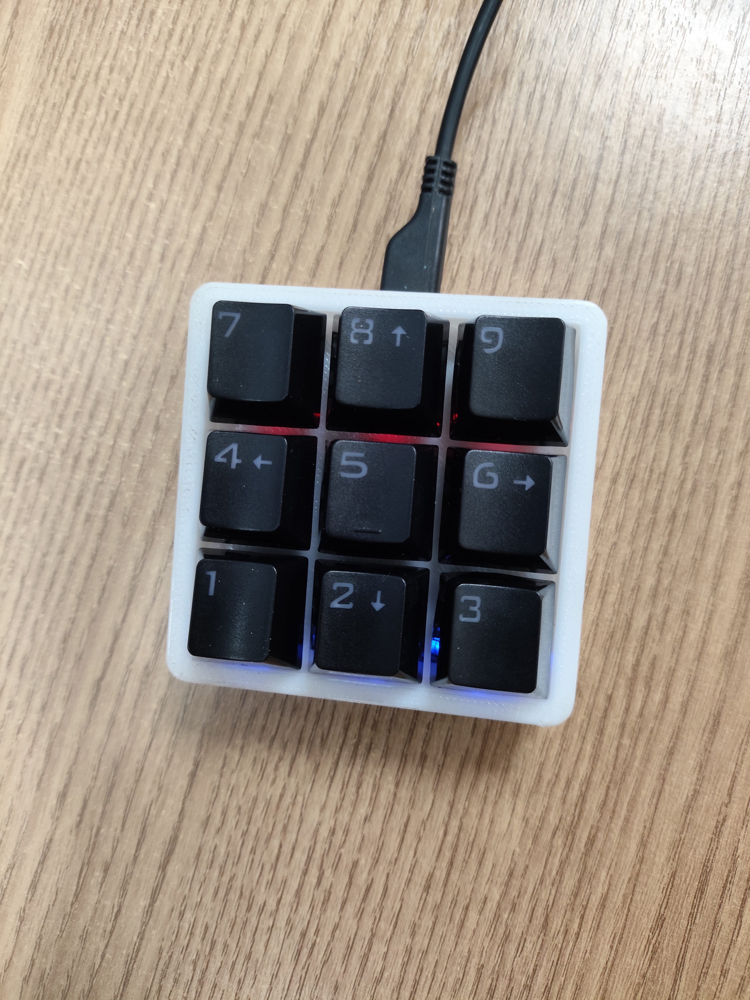

# Raspberry Pi Pico Stream Deck (9 Buttons + RGB Effects)

Projeto de **Stream Deck caseiro** usando um **Raspberry Pi Pico**,
programado na **Arduino IDE**, com **9 botões físicos** e **LED RGB com
efeitos estilo teclado gamer**.\
Cada botão envia comandos de teclado via **USB HID**, permitindo
controlar aplicações, macros e automações no computador.

------------------------------------------------------------------------

## 🚀 Funcionalidades

-   ⌨️ **9 botões programáveis** (F13--F21)
-   🌈 **Efeito RGB automático** com transição suave (rainbow/fade)
-   💻 Comunicação **USB HID** (funciona como teclado)
-   ⚡ Baixa latência
-   🔌 Conexão direta via USB
-   🧠 Ideal para macros e automação

------------------------------------------------------------------------

## 🔧 Hardware Utilizado

-   Raspberry Pi Pico
-   9 botões momentâneos
-   1 LED RGB
-   Resistores para os LEDs (recomendado)

------------------------------------------------------------------------

## 📌 Pinagem

### Botões

  Botão   GPIO
  ------- ------
  1       GP5
  2       GP6
  3       GP7
  4       GP8
  5       GP9
  6       GP10
  7       GP11
  8       GP12
  9       GP13

Cada botão deve ser conectado entre **GPIO e GND**, utilizando
`INPUT_PULLUP`.

### LED RGB

  Cor        GPIO
  ---------- ------
  Vermelho   GP20
  Verde      GP21
  Azul       GP22

------------------------------------------------------------------------

## 🎮 Comandos enviados

  Botão   Tecla enviada
  ------- ---------------
  1       F13
  2       F14
  3       F15
  4       F16
  5       F17
  6       F18
  7       F19
  8       F20
  9       F21

Essas teclas podem ser usadas em softwares de automação e macros.

------------------------------------------------------------------------

## 💡 Exemplos de uso

-   Controle de cenas no OBS
-   Atalhos para edição de vídeo
-   Automação de tarefas
-   Controle de música
-   Atalhos para jogos

------------------------------------------------------------------------

## 🛠️ Software necessário

-   Arduino IDE
-   Core **Raspberry Pi Pico / RP2040**
-   Biblioteca **Adafruit TinyUSB**

------------------------------------------------------------------------

## 🔮 Possíveis melhorias

-   LEDs individuais por botão
-   Display OLED para status
-   Interface de configuração no PC
-   Integração direta com OBS
-   Perfis de macros

------------------------------------------------------------------------

## 📜 Licença

Projeto open‑source para uso educacional e pessoal.
